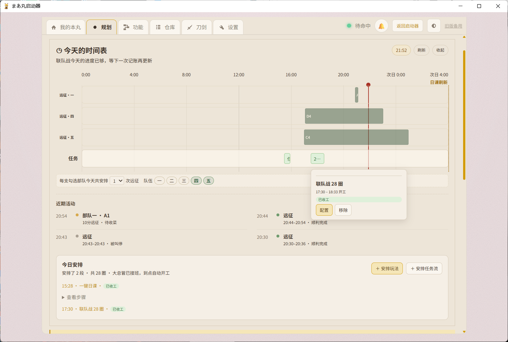
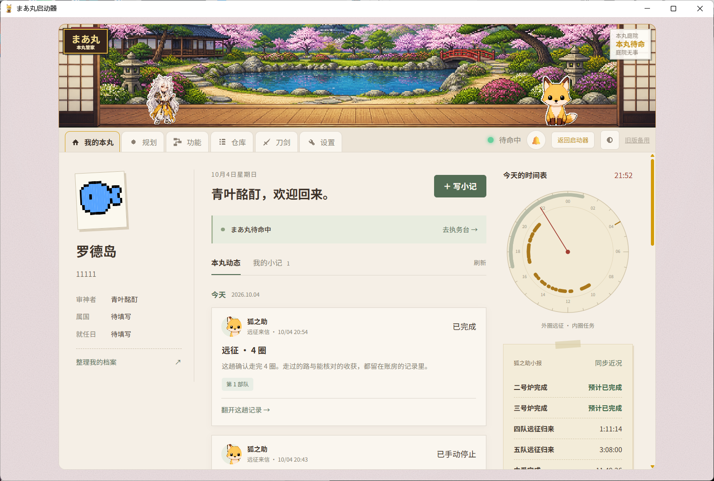

# まあ丸 `🦊` — 《刀剑乱舞 ONLINE》国服本丸管家

**简体中文** · [English](README_EN.md)

[](LICENSE)
[](pyproject.toml)
[](https://github.com/qymd-NOT-official/maamaru-engine)

> **你决定今天的本丸要做什么，执行、照看、收尾和记录交给まあ丸。**

**[下载最新版](https://github.com/qymd-NOT-official/maamaru-engine/releases/latest)** · **[功能与使用指南](docs/user-manual.md)** · [v1.1.1 更新内容](docs/releases/v1.1.1.md) · [提交问题](https://github.com/qymd-NOT-official/maamaru-engine/issues)

玩刀剑乱舞九年了，现在还是想玩，只是不想再亲自点完每一轮重复操作，也不想继续手拉 Excel 计算资源。所以我做了まあ丸：需要时替我照看本丸，回来时能翻翻这一天留下的记录。

## 第一次来，先跑一件小事

目前主要使用环境是 **Windows、MuMu 12、1280×720 游戏画面**。

1. 从下载页选择 `maamaru-setup-v*.exe` 安装。想用免安装版，就下载 `maamaru-launcher-v*.zip`，完整解压后运行 `まあ丸启动器.exe`。
2. 打开 MuMu 和游戏，进入本丸。打开启动器，等待检查完成；找不到模拟器时，点「选择模拟器」指定 MuMu 安装目录。
3. 点「启动まあ丸」，打开「功能 → 玩法设置」，选一项你想跑的任务。例如合战场：选好地图、部队，把次数设为 **1**，核对伤势处理和刀装设置。
4. 点「开始任务」，到「执务台」看日志，也观察模拟器实际操作。确认这一圈按自己的意思跑完，再增加次数。

不必先录完整刀账或做预算才能跑普通任务。想使用部队预设、了解资源或做规划时，再按下面的路线逐步准备。

启动遇到提醒，可看[安装与启动](docs/user-manual.md#安装与启动)；任务停下来，可看[任务为什么停了](docs/user-manual.md#任务为什么停了)。

## 平时怎么用

### 每天上线，把日课顺序存下来

打开「功能 → 流程搭建」，使用已有的一键日课，或复制一份改成自己的习惯：先领奖、演练、收远征，再出阵、收任务奖励。每一步都能调整顺序和设置，保存后下次直接运行。

只想跑一项任务，也可以在「玩法设置」中单独开始。单项玩法的设置只用于这次单跑；日课出阵和任务流中专门填写的设置各自保留。具体区别见[任务流与一键日课](docs/user-manual.md#任务流与一键日课)。


### 让远征队出门，顺便补好花

「功能 → 玩法设置 → 远征」可以收取归来的队伍，再按常用安排派出去。想晚些出发，就到「规划」的时间表安排远征；可以保持现有编队，也可以选已经保存的部队预设。

希望出发前补花，在这一班远征的「配置」里勾选「出发前补花」，再选伤势停止条件。まあ丸会针对这队需要补花的成员跑 1-1，恢复原队伍和装备后再派遣。补花需要时间，请把它算进自己的安排。

只想给本丸的刀轮流刷花，可单独运行「刷花」，设好使用的部队和本次最多刷几振。它会清理这支部队来单人刷花，请挑一支可以腾出来的队伍。选人规则和两种用法见[刷花与远征补花](docs/user-manual.md#刷花与远征补花)。

### 活动期间，安排今天要打多少

先跑几圈积累耗时与收获，再到「规划」设置活动目标。まあ丸会结合已有记录估算剩余圈数、时间和资源预算；记录不够时，也可以先填写估计。

今天的时间表里可以启用联队战与远征建议，也能定时启动保存好的任务流。建议会避让已有的任务安排；启用后才成为实际安排。点击块块查看详情或配置，拖动可改开工时间，按 **15 分钟**对齐。块块挤在一起时，点开可以查看重叠的任务。

到点开工需要面板保持运行、电脑没有休眠。运行中的任务与预计用时可能变化，拿不准时点时间表右上角「刷新」。详细操作见[规划与定时开工](docs/user-manual.md#规划与定时开工)。



### 挂机的时候，看看正在做什么

「功能 → 执务台」显示当前任务和日志，可以切去别的页面，再回来查看。任务停止时，先看最后几条消息和模拟器画面：可能是到达次数、资源不够、达到伤势条件，或某个页面没有认清。

需要立即停下，可以使用停止按钮。停止后先检查游戏页面和队伍状态，再决定怎样继续。


### 收工回来，看看今天带回了什么

「我的本丸」里有待机状态、归来与锻刀倒计时、收刀动态，也能写自己的小记、换头像和整理审神者档案。和纸与像素主题可以在设置里切换。

手动在游戏里领了新刀，想让记录更新，可以到「仓库」读取游戏家底，或到「刀剑」更新刀账；记录需要同步，倒计时到了也不代表已经领取。



「仓库」可以看家底、收支和任务记录。第一次打开时，把游戏停在本丸，点「读取游戏家底」；读取期间暂时不要操作模拟器。它会读取游戏记录和资源画面，之后可以再立目标、导入旧账，或者什么都不填，继续玩。

自己打的活动、额外的收支也能手动补记。想知道某笔收获从哪来，再展开对应记录。用法见[仓库与成绩单](docs/user-manual.md#仓库与成绩单怎么看)。


## 想找某个功能

| 想做的事 | 说明 |
|---|---|
| 保存日课、组合任务、安排收尾动作 | [任务流与一键日课](docs/user-manual.md#任务流与一键日课) |
| 定时开工、拖动时间表、安排远征 | [规划与定时开工](docs/user-manual.md#规划与定时开工) |
| 刷花、给远征队出发前补花 | [刷花与远征补花](docs/user-manual.md#刷花与远征补花) |
| 保存编队、选择具体一振、指定装备 | [部队预设](docs/user-manual.md#部队预设试用) |
| 合战场、异去、大阪城与活动 | [出阵与活动任务](docs/user-manual.md#出阵与活动任务) |
| 伤势、手入、刀装、阵形与换队长 | [出阵的共用设置](docs/user-manual.md#出阵的共用设置) |
| 收远征、锻刀、炼糖、盘点库存 | [远征与其他工具](docs/user-manual.md#远征锻刀与其他独立工具) |
| 更新刀账、查收支、导入导出账本 | [刀账](docs/user-manual.md#刀账与所持名单) · [仓库](docs/user-manual.md#仓库与成绩单怎么看) |
| 任务停止、反馈问题、更新和迁移 | [排查停止](docs/user-manual.md#任务为什么停了) · [更新与数据](docs/user-manual.md#更新卸载与数据迁移) |

功能指南也会说明まあ丸读取什么、按什么条件选择和执行。配置前可以先看对应条目，知道哪些操作会换人、使用资源或停止任务。

## 使用前知道这些

本项目与游戏运营方无关，包含游戏自动操作，可能违反游戏服务条款并带来账号处罚、误操作或数据损失风险，请自行判断是否使用。第一次使用新任务或游戏更新后，先跑少量次数确认。

- 出阵前会检查队伍、伤势和刀装；确认重伤时会拦截。资源消耗、手入和名单按你保存的设置执行。
- 游戏更新、不同分辨率或新地图可能影响识别。江户城目前只智能跑 E4；各玩法的具体范围见功能指南。
- 部队预设与换装仍在试用，先用容易复原的队伍验证。
- 独立账房入口与 Android APK 暂停提供；账房从完整面板的「仓库」进入。
- 配置与记录保存在本机。安装版位于 `%LOCALAPPDATA%\Maamaru`，源码版位于 `%LOCALAPPDATA%\Maamaru-Dev`，更新不会删除用户数据。

遇到问题，保留模拟器当前画面，从面板或启动器导出「反馈错误」，在 [GitHub Issues](https://github.com/qymd-NOT-official/maamaru-engine/issues) 附上版本、任务和复现步骤。详见[反馈错误](docs/user-manual.md#反馈错误)。

<details>
<summary><strong>开发者运行与项目结构</strong></summary>

环境要求：Windows、Python 3.12+；正常管家模式还需要 MuMu 模拟器和 ADB。

```powershell
git clone https://github.com/qymd-NOT-official/maamaru-engine.git
cd maamaru-engine
python -m venv .venv
.\.venv\Scripts\python.exe -m pip install -e .
.\.venv\Scripts\python.exe maamaru_app.py
```

也可以直接双击 `启动源码版.cmd`。默认面板地址为 `http://127.0.0.1:8080`；安装版和源码版不建议同时运行。

まあ丸由 Python 长任务编排、ADB、MaaFramework、FastAPI 与 Vue 3 / TypeScript 组成。程序文件和用户数据严格分开，旧目录迁移会先复制、备份并校验，不自动删除来源。详细契约见 [用户数据与迁移](docs/data-layout.md) 和 [结构化运行数据](docs/telemetry-data.md)。

```text
maamaru-engine/
├─ launcher/            启动器、更新与数据迁移
├─ panel/               FastAPI 后端和 Vue 本丸面板
├─ ledger_app/          独立账房与 Android 离线版
├─ touken/flows/        日课、出阵、活动、远征与恢复流程
├─ resource/base/       OCR、模型和识别模板
├─ profiles/            活动运行配置
└─ docs/                使用说明、版本记录与开发文档
```

支持仓库协作的 Agent 可以先阅读 [まあ丸 Agent 使用协助规范](docs/agent-user-guide.md)，再帮助玩家检查环境、修改配置或定位停止原因。

</details>

## 鸣谢

まあ丸使用 [MaaFramework](https://github.com/MaaXYZ/MaaFramework) 提供的视觉识别能力，并由 [FastAPI](https://github.com/tiangolo/fastapi)、[Vue](https://github.com/vuejs/core)、[Vite](https://github.com/vitejs/vite)、[pywebview](https://github.com/r0x0r/pywebview)、[Fusion Pixel](https://github.com/TakWolf/fusion-pixel-font) 与 [Kenney Game Icons](https://kenney.nl/assets/game-icons) 等开源项目共同支撑。完整许可证信息见 [NOTICE](NOTICE)。

まあ丸本身也由人类与 AI 共同开发：人类提出真实场景、定义玩法规则和安全边界、判断方案并实机验收；Kimi Code K3、Codex 与 WorkBuddy 作为协作者参与实现、排障、测试和发布。

本项目以 [AGPL-3.0-or-later](LICENSE) 开源。

<details>
<summary>仓库彩蛋：MCS（Multi-Cow System，多牛协同生产系统）🐂🌙</summary>

仓库里把多 Agent 协作戏称为 MCS：前端牛、脚本牛、IT 外包牛和 README 牛各干一摊，再由人类传递信息、拍板和验收。为什么都是牛？因为 Codex 的桌宠叫 **NULL**，读快了很像“牛”。

### 月下铸经 `🌙`

> _此真经非一人之力，谨遵 vibe coding 之古训，特铭众道友功德于源流。_

昔有月之暗面，遣基米可叁下凡，铸其后端；又有接屁踢五点六昊天，司前端之事；复得工作伙伴深度求索威肆，稍加点化，终成《麻麻露真经》。

> _本丸以大蛇为主，爪哇为辅。若有 Bug，皆属天命；若无 Bug，皆赖诸位道友相助。_

</details>
