# Maamaru `🦊` — A Honmaru Steward for Touken Ranbu ONLINE

[**简体中文**](README.md) · **English**

[](LICENSE)
[](https://github.com/qymd-NOT-official/maamaru-engine)

I have played Touken Ranbu for nine years, and I still want to keep playing. I just no longer want to click through every repetitive task myself—or keep an Excel sheet by hand to track resources. That is why I built Maamaru: to look after my Honmaru when needed, and leave records I can read when I return.


> **You decide what your Honmaru should do today. Maamaru handles the routine, keeps watch, wraps up, and keeps the records.**

On the China server, run tasks or simply keep a ledger. On the Japanese server, connect the dedicated game browser to update your Honmaru records while you play. The app's interface is in Simplified Chinese.

**[Download](https://github.com/qymd-NOT-official/maamaru-engine/releases/latest)** · **[User guide (Chinese)](docs/user-manual.md)** · [What's new in v1.3.1](docs/releases/v1.3.1.md) · [Report an issue](https://github.com/qymd-NOT-official/maamaru-engine/issues)

## Set up the daily routine once

In Planning → Today's Arrangements (规划 → 今日安排), choose today's dailies, check their settings, and set planned expeditions and the ending action. Back at home, Execute Today's Schedule hands over that arrangement: due expeditions are confirmed first, followed by the daily checklist.

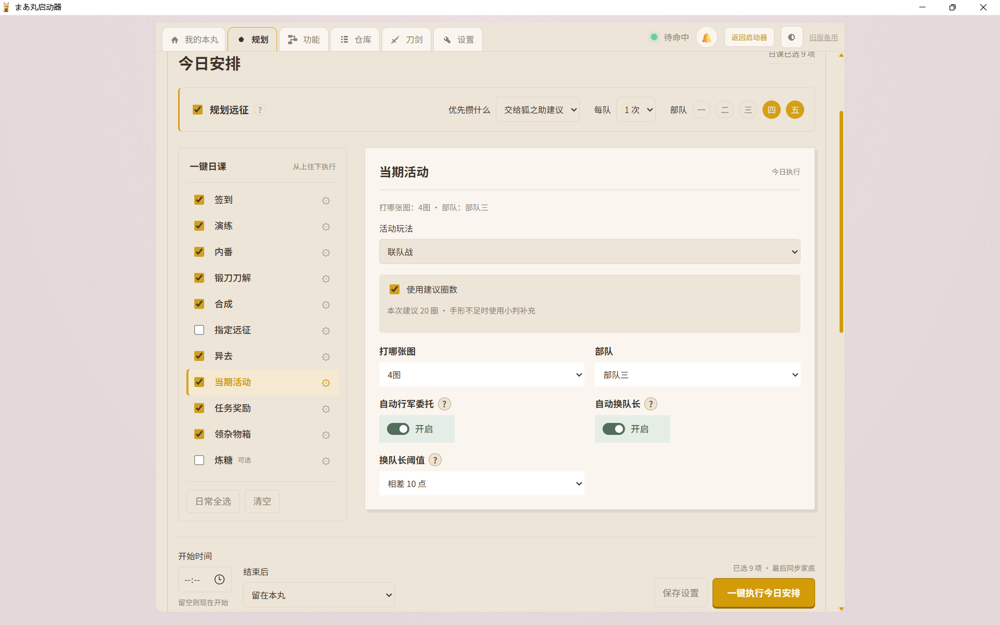

During events, use existing records to estimate remaining runs, time, and resources. Enabling recommended Regiment Battle runs also enables koban-funded ticket refill. You choose whether to turn it on.

<details>
<summary>Start later, or refresh an expedition team's sakura first</summary>

Schedule expeditions, Regiment Battle, or saved workflows on the timetable, then drag them to adjust their start time. Expeditions can use team presets and refresh sakura before departure. Maamaru restores and checks the original team and equipment before sending it out. This takes time and overwrites the game's team record slot one; read the [sakura guide](docs/user-manual.md#刷花与远征补花) first.

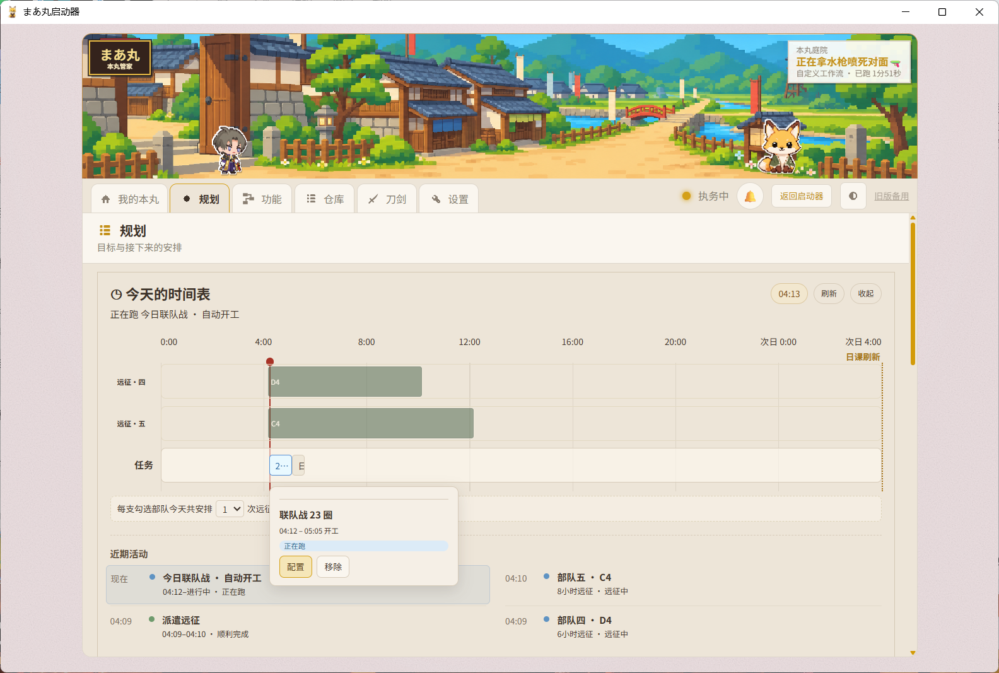

Scheduled work requires the panel to stay open and the computer to stay awake. See [Planning and scheduling](docs/user-manual.md#规划与定时开工).

</details>

## Just a few tasks today? That works too

Functions (功能) runs **a standalone task or one custom workflow**. Pick a map, team, and run count in Gameplay Settings, or add and reorder steps in the Workflow Builder. **The one-click daily checklist is configured in Planning.** Daily, standalone, and workflow parameters are saved separately.

<table>
<tr><th width="50%">Run one task</th><th width="50%">Build your own sequence</th></tr>
<tr><td><a href="docs/assets/product/10-single-task-settings.png">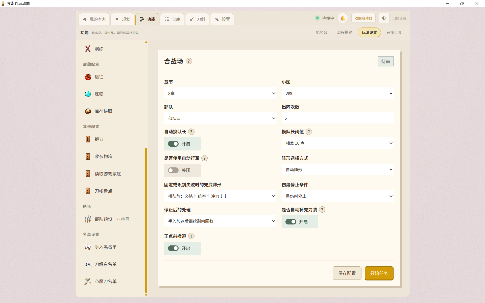</a></td><td><a href="docs/assets/product/08-workflow-builder.png">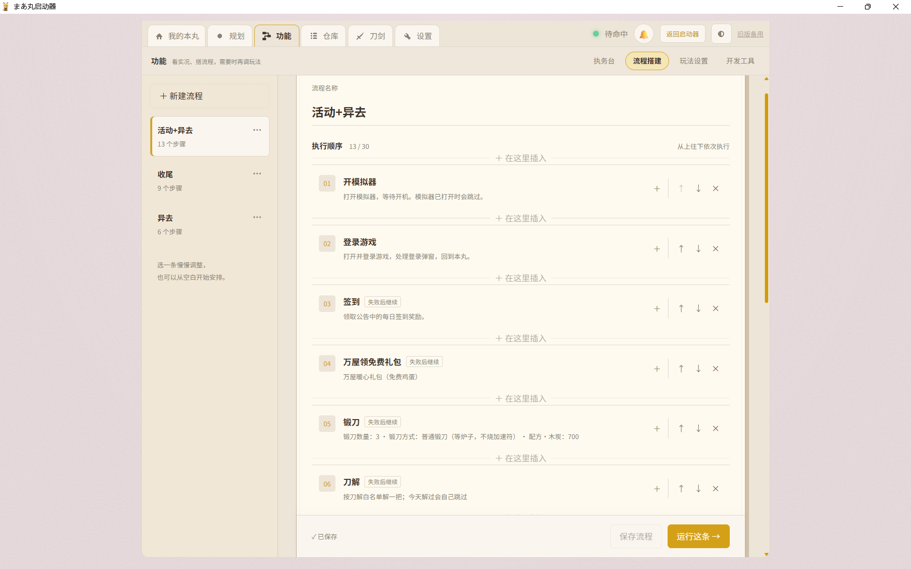</a></td></tr>
<tr><td>Use your saved injury, repair, troop, and captain settings for this run.</td><td>Set parameters for each step and save the sequence for another day.</td></tr>
<tr><th>Follow the task at the desk</th><th>Add the steps you need</th></tr>
<tr><td><a href="docs/assets/product/07-task-desk.png">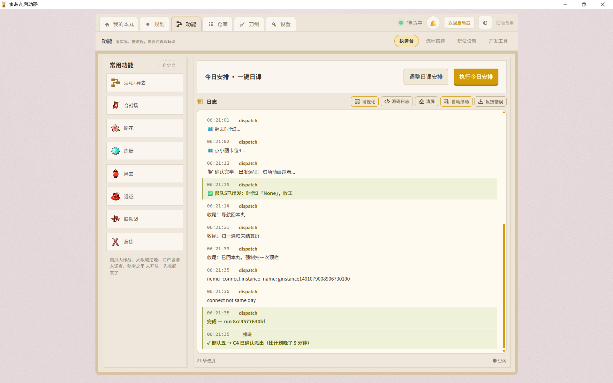</a></td><td><a href="docs/assets/product/09-workflow-steps.png">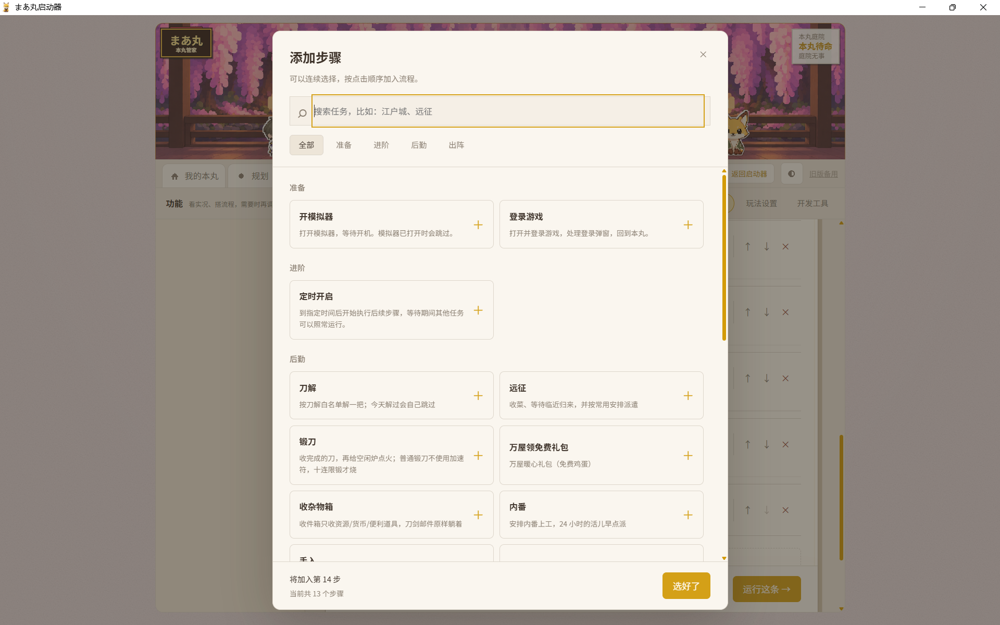</a></td></tr>
<tr><td>Return here to check progress and the reason a task stopped.</td><td>Combine startup, login, sorties, and support tasks in your preferred order.</td></tr>
</table>

Before departure, Maamaru checks the team, injuries, and equipment, and blocks confirmed critical injuries. When a task stops, check its latest messages and the game screen before continuing. [Supported tasks](docs/user-manual.md#出阵与活动任务) · [Workflows and dailies](docs/user-manual.md#任务流与一键日课)

## Balances without hand-copying, swords with a history

Warehouse brings together your latest recorded balances, resource trends, and transactions. The sword archive keeps level, cumulative experience, Ranbu progress, and acquisition time for each individual sword. Duplicate swords stay separate, and you can mark your favorites.

<table>
<tr><th width="50%">Your Honmaru's balances</th><th width="50%">Each sword's archive</th></tr>
<tr><td><a href="docs/assets/product/03-inventory.png">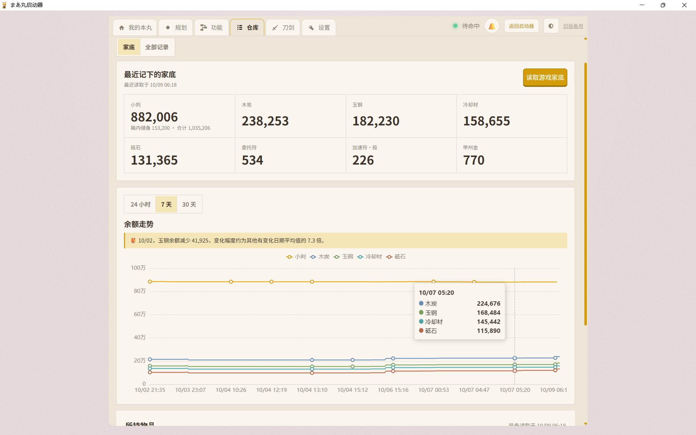</a></td><td><a href="docs/assets/product/04-sword-archive.png">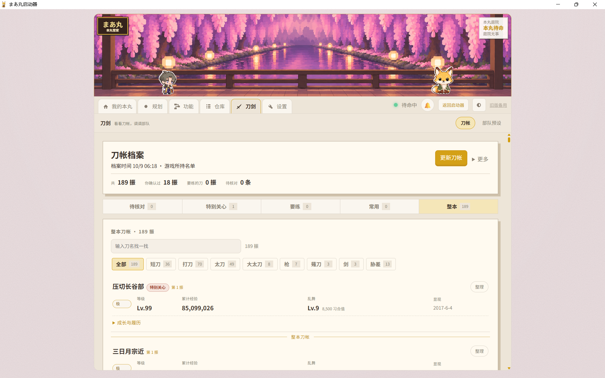</a></td></tr>
<tr><td>See what remains and how resources have changed.</td><td>Find a sword, mark it for training, and browse its recorded growth.</td></tr>
</table>

On the China server, leave the game at the Honmaru and click Read Game Balances (读取游戏家底); avoid interacting with the emulator during collection. Import an old ledger or add transactions yourself when needed. Incomplete collection can be retried. Records need synchronization, and an expired countdown does not mean something has been collected. [Warehouse](docs/user-manual.md#仓库与成绩单怎么看) · [Sword archive](docs/user-manual.md#刀账与所持名单)

## Save the teams and equipment you use often

In Swords → Team Presets, select individual swords and save troop, horse, charm, and treasure settings for tasks that support presets. Empty slots stay as they are; missing requested members or equipment stop the operation.

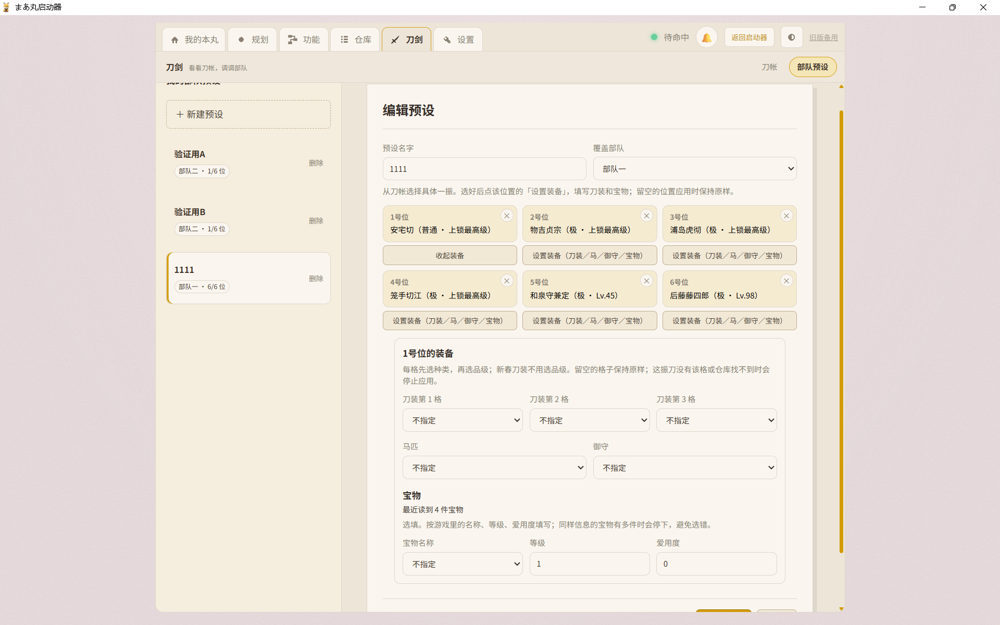

Team presets and equipment changes are still in trial. Try a short run with a team you can easily restore, and check the result before using an important arrangement. [Team preset guide](docs/user-manual.md#部队预设试用)

## Come back and browse the day

Tasks, spending, and gains live in All Records, grouped by date. Expand battle drops and forging notes to find which map brought a sword home, or a forge's recipe and result. Unconfirmed sources remain unknown.

<table>
<tr><th width="50%">Records by date</th><th width="50%">Drops by map</th></tr>
<tr><td><a href="docs/assets/product/06-records.png">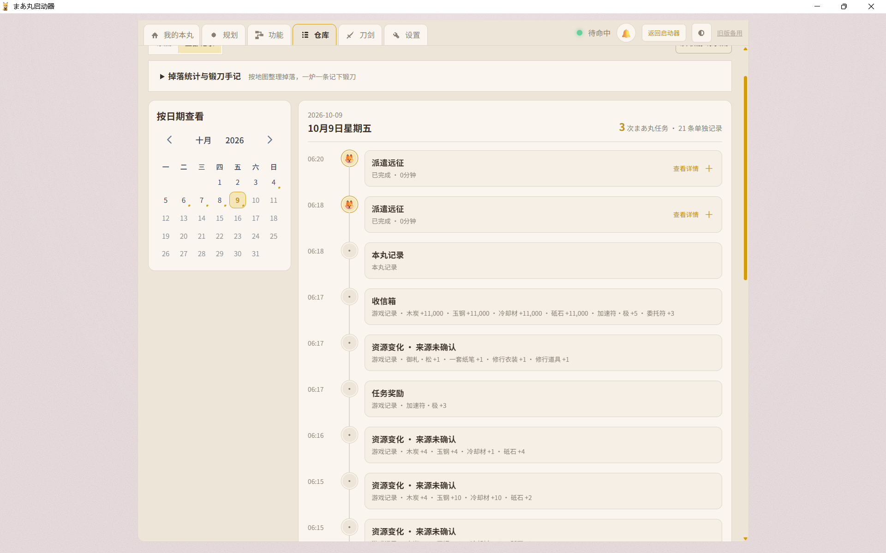</a></td><td><a href="docs/assets/v1.2-drops.png">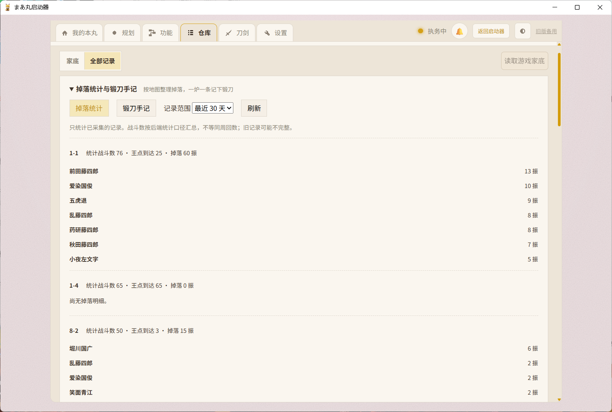</a></td></tr>
<tr><td>Open a task to see its results and related transactions.</td><td>Browse battle drops and forging records when you need them.</td></tr>
</table>

Back in My Honmaru, write your own notes, change your avatar, edit your Saniwa profile, or switch between washi-paper and pixel themes. Make it feel like yours.

## Keep a ledger, or hand over the routine

| Feature | China server | Japanese server |
|---|---|---|
| Honmaru home, profile, and notes | ✓ | ✓ |
| Balance, item, and sword records | ✓ | ✓ |
| Update records | Read balances, update the archive, or sync after related tasks | Connect the dedicated game browser; update during play |
| Standalone tasks, custom workflows, and dailies | ✓ | — |
| Automated sorties, expeditions, and scheduled work | ✓ | — |

Choose the corresponding Honmaru in the launcher. Settings, profiles, notes, and records stay separate between servers. The Japanese-server entry provides the ledger and Honmaru display. [Japanese-server guide](docs/user-manual.md#日服本丸账房)

## Get started

The primary environment for China-server automation is **Windows, MuMu Player 12, and a 1280×720 game screen**.

1. [Download the latest release](https://github.com/qymd-NOT-official/maamaru-engine/releases/latest). Install `maamaru-setup-v*.exe`, or fully extract `maamaru-launcher-v*.zip` and run `まあ丸启动器.exe`.
2. China server: open MuMu, enter the game's Honmaru, then choose Start Maamaru after the launcher finishes checking. Use Select Emulator if you need to locate the installation. Japanese server: choose 日服本丸 and follow the panel's instructions to connect the dedicated game browser.
3. To run a task, open Functions → Gameplay Settings, check the map, team, injury rules, and spending settings, then try **one supervised run**. To start bookkeeping, open Warehouse and read game balances.

You do not need a complete sword archive or budget to run ordinary tasks. Set up your daily checklist in Planning when you are ready.

**Detailed instructions → [User guide (Chinese)](docs/user-manual.md)**. See [setup](docs/user-manual.md#安装与启动) or [why a task stopped](docs/user-manual.md#任务为什么停了) for help.

## Before using Maamaru

This independent fan project is not affiliated with the game's operators. It includes automated game interactions that may violate the game's terms and lead to account penalties, unintended actions, or data loss. Decide for yourself whether to use it, and test new tasks with short supervised runs, especially after game updates.

- You choose teams, injury conditions, spending permissions, and protected swords. Check those settings before starting.
- Game updates, other resolutions, and new maps can affect recognition. Edo Castle currently supports E4 only; see the guide for each task's scope.
- The standalone ledger entry and Android APK are paused. Open Warehouse in the full panel for bookkeeping.
- Configuration and records stay local: installed builds use `%LOCALAPPDATA%\Maamaru`; source builds use `%LOCALAPPDATA%\Maamaru-Dev`. Updates preserve user data.

If something goes wrong, preserve the emulator screen and export feedback from the panel or launcher. Open a [GitHub Issue](https://github.com/qymd-NOT-official/maamaru-engine/issues) with the version, task, and reproduction steps. [Feedback guide](docs/user-manual.md#反馈错误)

<details>
<summary><strong>Running from source and project structure</strong></summary>

Requirements: Windows and Python 3.12+. Normal steward mode also requires MuMu Player and ADB.

```powershell
git clone https://github.com/qymd-NOT-official/maamaru-engine.git
cd maamaru-engine
python -m venv .venv
.\.venv\Scripts\python.exe -m pip install -e .
.\.venv\Scripts\python.exe maamaru_app.py
```

You can also double-click `启动源码版.cmd`. The panel opens at `http://127.0.0.1:8080` by default. Running the installed and source versions at the same time is not recommended.

Maamaru combines Python orchestration, ADB, MaaFramework, FastAPI, and Vue 3 with TypeScript. Program files and user data are kept strictly separate. Migration from an old data directory copies, backs up, and verifies data before use; it never deletes the source automatically. See [User Data and Migration](docs/data-layout.md) and [Structured Runtime Data](docs/telemetry-data.md) for the detailed contracts (Chinese).

```text
maamaru-engine/
├─ launcher/            Launcher, updates, and data migration
├─ panel/               FastAPI backend and Vue Honmaru panel
├─ ledger_app/          Standalone ledger and Android offline edition
├─ touken/flows/        Dailies, sorties, events, expeditions, and recovery
├─ resource/base/       OCR, models, and recognition templates
├─ profiles/            Event runtime configuration
└─ docs/                User guide, release notes, and developer documentation
```

</details>

## Acknowledgements

Maamaru uses [MaaFramework](https://github.com/MaaXYZ/MaaFramework) for visual recognition and is built with open-source projects including [FastAPI](https://github.com/tiangolo/fastapi), [Vue](https://github.com/vuejs/core), [Vite](https://github.com/vitejs/vite), [pywebview](https://github.com/r0x0r/pywebview), [Fusion Pixel](https://github.com/TakWolf/fusion-pixel-font), and [Kenney Game Icons](https://kenney.nl/assets/game-icons). See [NOTICE](NOTICE) for complete license information.

Maamaru itself is also a collaboration between a human and AI. The human brings real use cases, defines gameplay rules and safety boundaries, chooses among proposed solutions, and validates them on a real device. Kimi Code K3, Codex, and WorkBuddy collaborate on implementation, debugging, testing, and releases.

Maamaru is open source under the [AGPL-3.0-or-later](LICENSE) license.

<details>
<summary>Repository easter egg: MCS (Multi-Cow System) 🐂🌙</summary>

We jokingly call our multi-agent workflow the MCS: the frontend cow, automation cow, outsourced-IT cow, and README cow each take a part of the job, while the human carries context between them, makes the decisions, and signs off on the result. Why cows? Codex's desktop pet is named **NULL**, which sounds a lot like the Chinese word for cow when you say it quickly.

### The Scripture Forged Beneath the Moon `🌙`

> _This sacred text was not wrought by one hand alone. In faithful observance of the ancient art of vibe coding, we hereby record every fellow cultivator's contribution at its source._

In ancient times, Moonshot AI sent Kimi K3 down from the heavens to forge the backend. Then came GPT-5.6 of the High Heavens to preside over the frontend. WorkBuddy DeepSeek V4 offered one final touch of enlightenment, and thus the *Maamaru Sutra* was complete.

> _This Honmaru follows the Great Python, with Java as its aide. If there are bugs, such is the Mandate of Heaven; if there are none, all credit belongs to our fellow cultivators._

</details>
